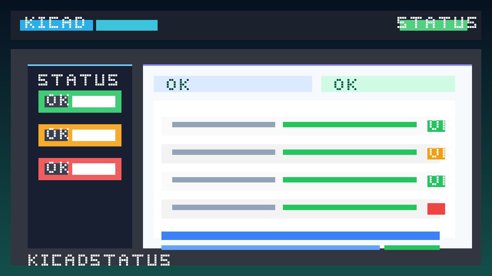

# KiCad Studio

[](https://marketplace.visualstudio.com/items?itemName=oaslananka.kicadstudio)
[](https://marketplace.visualstudio.com/items?itemName=oaslananka.kicadstudio)
[](https://www.kicad.org)
[](https://github.com/oaslananka/kicad-mcp-pro)
[](https://copilot.github.com)
[](https://dev.azure.com/oaslananka/open-source/_git/kicad-studio)

KiCad Studio turns VS Code into a practical KiCad workspace: view schematics and PCBs, run DRC/ERC, inspect BOMs and netlists, export manufacturing outputs, compare changes, search components and libraries, and optionally connect AI tooling through `kicad-mcp-pro`.


## Repository And CI/CD

- **Canonical Repository:** `https://github.com/oaslananka/kicad-studio`
  All development and user interaction happens here. Zero GitHub Actions are consumed on this account.
- **CI/CD Mirror:** `https://github.com/oaslananka-lab/kicad-studio`
  Automated CI, security scans, and releases run here. The mirror periodically pulls from canonical.
- **Operations:** See [docs/repository-operations.md](docs/repository-operations.md) for detailed guidance on the dual-owner model.
- **Fallbacks:** Azure DevOps and GitLab pipelines are maintained for manual redundancy.

## What's New In 2.6.0

- MCP compatibility negotiation for `kicad-mcp-pro >=3.0.0 <4.0.0`, with recommended status for `>=3.0.2 <4.0.0`.
- Quality Gates sidebar for project, placement, transfer, and manufacturing readiness checks.
- One-click `kicad-mcp-pro` installer with `uvx`, `pipx`, and `pip` fallback options.
- MCP profile picker for `full`, `minimal`, `schematic_only`, `pcb_only`, `manufacturing`, `high_speed`, `power`, `simulation`, `analysis`, and `agent_full`.
- Code Actions for MCP fix queue items that include source `path` and `line` metadata.
- Manufacturing release wizard with MCP pre-flight gate inspection and structured error hints.
- JSON schema validation for `.vscode/mcp.json` and a redacted MCP traffic log viewer.

## Feature Highlights

- Interactive schematic and PCB viewing through a bundled KiCanvas build.
- DRC/ERC diagnostics mapped into the VS Code Problems panel.
- Fabrication and documentation exports including Gerber, drill, IPC-2581, ODB++, DXF, GenCAD, IPC-D-356, BOM, netlist, 3D GLB/BREP/PLY, and 3D PDF.
- Variants, DRC rules, and AI fix queue sidebars for KiCad 10-era workflows.
- MCP Quality Gates sidebar for release-readiness review when `kicad-mcp-pro` is connected.
- Optional AI providers: Claude, OpenAI, GitHub Copilot, and Gemini.
- Agent-mode Language Model Tools for DRC/ERC, Gerber export, file opening, component search, library search, active-context reads, and variant switching.
- Optional Claude-backed Language Model Chat Provider registration for compatible VS Code builds.
- `kicad-mcp-pro` bootstrap, context bridge, and design intent form panel.
- Local KiCad symbol and footprint indexing plus Octopart/Nexar and LCSC component search.
- GitHub-organization-first CI/CD with Azure DevOps and GitLab manual fallback workflows.

## KiCad Support Matrix

| Capability                  | KiCad 9                               | KiCad 10                                            |
| --------------------------- | ------------------------------------- | --------------------------------------------------- |
| Schematic / PCB viewer      | Supported                             | Supported with improving upstream KiCanvas coverage |
| DRC / ERC via `kicad-cli`   | Supported                             | Supported                                           |
| Design variants sidebar     | Limited project fallback              | Supported                                           |
| `.kicad_dru` rule discovery | Basic text mode                       | Supported                                           |
| 3D PDF export               | Not available                         | Supported                                           |
| Time-domain tuning metadata | Not available                         | Supported                                           |
| MCP-assisted fix workflows  | Supported when project context exists | Supported                                           |

## AI And MCP

### AI Providers

- Claude and OpenAI use SecretStorage-backed API keys.
- GitHub Copilot and Gemini use the VS Code Language Model API when available.
- AI features remain opt-in and are disabled when no provider is configured.

### `kicad-mcp-pro` Integration

- Auto-detects `kicad-mcp-pro` from `uvx`, a global executable, `pip`, or `pipx`.
- Installs `kicad-mcp-pro` from VS Code Tasks when `uvx`, `pipx`, or `pip` is available.
- Offers to create `.vscode/mcp.json` in the active workspace.
- Validates `.vscode/mcp.json` with KiCad-aware schema completions.
- Registers `kicad-mcp-pro` as an MCP server definition when the host VS Code build supports the API.
- Negotiates the server version and reports connected, older-than-recommended, incompatible, disconnected, or not-installed states in a single MCP status entry.
- Uses Streamable HTTP-compatible requests for the extension-side MCP client and reuses `MCP-Session-Id` values when provided by the server.
- Pushes active file, DRC summary, selection context, cursor position, visible layer set, and active variant to MCP.
- Surfaces `kicad://project/fix_queue` as the `AI Fix Queue` view.
- Surfaces `project_quality_gate_report`, placement, transfer, and manufacturing gate results in the `Quality Gates` view.
- Shows redacted recent MCP request/response traffic through `KiCad: Open MCP Log`.
- Lets users edit project design intent from a dedicated webview form.



#### Compatibility

KiCad Studio 2.6.0 supports `kicad-mcp-pro >=3.0.0 <4.0.0` and recommends `>=3.0.2 <4.0.0`. The extension was tested against `kicad-mcp-pro 3.0.2`. If a connected server reports a version outside the required range, MCP-dependent commands are disabled and KiCad-only viewers, exports, checks, BOM/netlist, language services, and library features continue to work.

See [docs/INTEGRATION.md](docs/INTEGRATION.md) for the detailed MCP workflow.

## Quick Start

1. Install KiCad 10 if you want full variant, tuning, and 3D PDF support.
2. Install the extension from the VS Code Marketplace.
3. Open a folder containing a `.kicad_pro`, `.kicad_sch`, or `.kicad_pcb` file.
4. Run `KiCad: Detect kicad-cli` once to validate your local KiCad installation.
5. Open a schematic or PCB file to use the viewer, project tree, BOM, netlist, and export commands.
6. Optionally run `KiCad: Install kicad-mcp-pro`, then `KiCad: Setup MCP Integration`.
7. Pick a focused MCP profile with `KiCad: Pick MCP Profile` if the default `full` profile is broader than the current workflow.
8. If you want KiCad Studio to appear as a chat-model vendor, run `KiCad: Manage Chat Provider` and store a Claude API key.

## Installation

### VS Code

```bash
code --install-extension oaslananka.kicadstudio
```

### KiCad CLI

- Windows: KiCad Studio auto-checks common `Program Files` KiCad locations, including KiCad 10.
- macOS: it checks the KiCad app bundle and common Homebrew paths.
- Linux: it checks standard binary locations such as `/usr/bin`, `/usr/local/bin`, and `~/.local/bin`.

If detection fails, set `kicadstudio.kicadCliPath` manually. More detail lives in [docs/installation.md](docs/installation.md).

## Key Commands

- `KiCad: Detect kicad-cli`
- `KiCad: Run Design Rule Check (DRC)`
- `KiCad: Run Electrical Rule Check (ERC)`
- `KiCad: Export 3D PDF`
- `KiCad: Setup MCP Integration`
- `KiCad: Install kicad-mcp-pro`
- `KiCad: Pick MCP Profile`
- `KiCad: Run All Quality Gates`
- `KiCad: Manufacturing Release Wizard`
- `KiCad: Open MCP Log`
- `KiCad: Open Design Intent`
- `KiCad: Open AI Chat`
- `KiCad: Manage Chat Provider`
- `KiCad: New Variant`
- `KiCad: Compare Variant BOMs`

## Viewer Notes

- Large board files stay interactive up to 10 MB; above that, the viewer falls back to metadata-first behavior.
- The viewer syncs with the active VS Code theme when enabled.
- PCB viewer panels expose layer visibility presets and tuning profile summaries when metadata is available.
- PNG export is generated from the embedded viewer canvas; SVG export uses the extension export command path.

## Import And Export Notes

- Board import helpers currently wrap the `kicad-cli pcb import` formats exposed by the installed KiCad version.
- Current guided import commands target formats such as PADS, Altium, Eagle, CADSTAR, Fabmaster, P-CAD, and SolidWorks PCB.
- If KiCad adds more CLI import formats later, the wrapper layer can extend without changing the rest of the extension architecture.

## Configuration

Important settings include:

- `kicadstudio.kicadCliPath`
- `kicadstudio.kicadPath`
- `kicadstudio.ai.provider`
- `kicadstudio.ai.model`
- `kicadstudio.ai.language`
- `kicadstudio.ai.allowTools`
- `kicadstudio.cli.defineVars`
- `kicadstudio.mcp.autoDetect`
- `kicadstudio.mcp.endpoint`
- `kicadstudio.mcp.allowLegacySse`
- `kicadstudio.mcp.pushContext`
- `kicadstudio.mcp.profile`
- `kicadstudio.mcp.logSize`
- `kicadstudio.viewer.largeFileThresholdBytes`
- `kicadstudio.viewer.syncThemeWithVscode`
- `kicadstudio.viewer.enableLayerPanel`
- `kicadstudio.viewer.enableSnapshotExport`

## Documentation

- [docs/ARCHITECTURE.md](docs/ARCHITECTURE.md)
- [docs/INTEGRATION.md](docs/INTEGRATION.md)
- [docs/KICAD10_MIGRATION.md](docs/KICAD10_MIGRATION.md)
- [docs/AI_PROVIDERS.md](docs/AI_PROVIDERS.md)
- [docs/installation.md](docs/installation.md)
- [docs/CONTRIBUTING.md](docs/CONTRIBUTING.md)

## Troubleshooting

### `kicad-cli` not found

- Run `KiCad: Detect kicad-cli`.
- Set `kicadstudio.kicadCliPath` if KiCad lives in a custom location.
- Check [docs/installation.md](docs/installation.md) for per-platform setup notes.

### MCP not connected

- Confirm `kicad-mcp-pro --version` or `uvx kicad-mcp-pro --version` works locally.
- Verify `.vscode/mcp.json` exists in the workspace.
- Check that `kicadstudio.mcp.endpoint` matches your HTTP-mode MCP server when using the context bridge.

### Viewer looks incomplete on KiCad 10 content

- Save the file and refresh the viewer.
- Confirm the bundled KiCanvas build refreshed successfully.
- If a new KiCad 10 entity is not yet rendered upstream, use `Open in KiCad` as the source of truth and file an issue with a fixture.

## Development

### Local Commands

- `npm ci`
- `npm run check`
- `npm run check:ci`
- `npm run format:check`
- `npm run lint`
- `npm run typecheck`
- `npm run test:unit`
- `npm test`
- `npm run build`
- `npm run build:prod`
- `npm run package`

### CI/CD Layout

- `.github/workflows/ci.yml` and `.github/workflows/publish.yml` are the primary GitHub Actions workflows for the `oaslananka-lab` organization mirror.
- `azure-pipelines-ci.yml` and `azure-pipelines-publish.yml` are manual fallback Azure pipelines.
- `.gitlab-ci.yml` is a manual fallback GitLab pipeline.

## Contributing

Contribution guidance lives in [docs/CONTRIBUTING.md](docs/CONTRIBUTING.md).

## License

MIT

## Operations

See [docs/repository-operations.md](docs/repository-operations.md) for CI/CD and release guidance.
